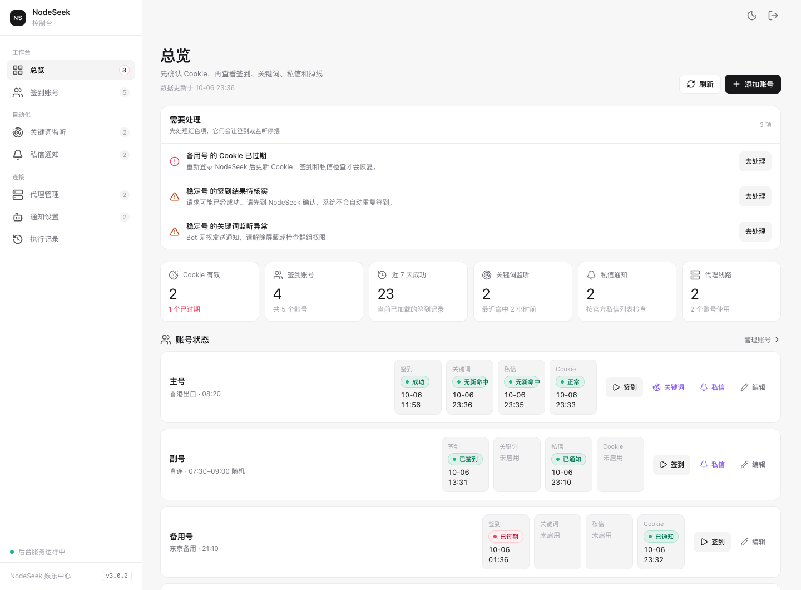
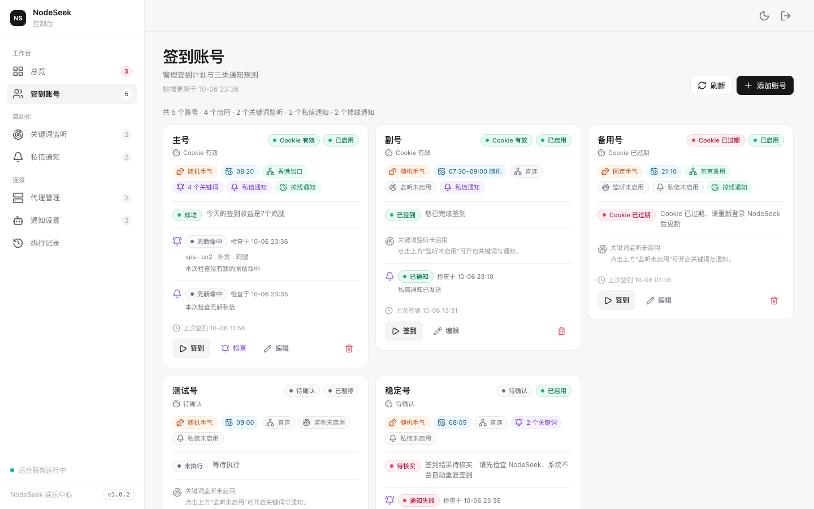
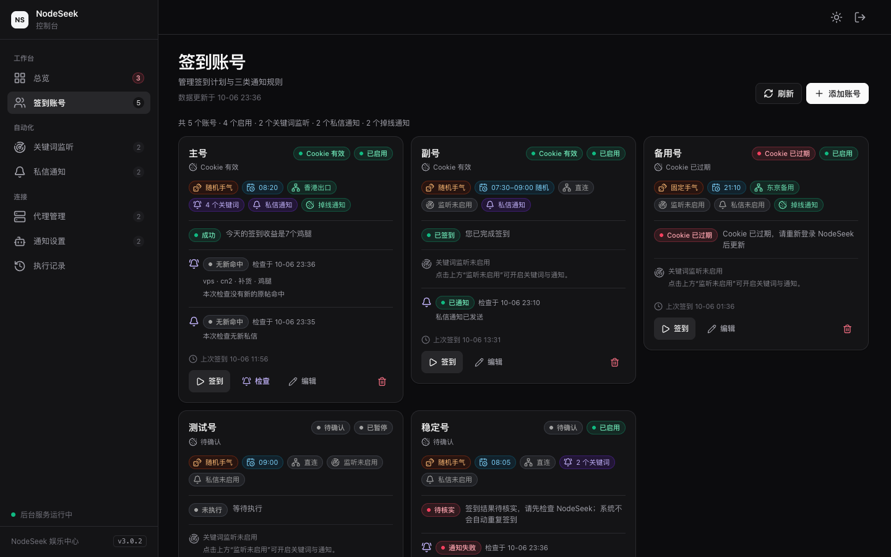

[](https://github.com/3128769/ns-entertainment/actions/workflows/ci.yml)
[](LICENSE)

# NodeSeek 娱乐中心

NodeSeek 管理程序：**每日自动签到**、**关键词监听**（新帖标题命中就通知）、**私信通知**、**Cookie 掉线提醒**，通知发到 Telegram。

**任何人都可以把本仓库拉到自己的服务器上安装**：每个人装出来的都是一个独立的、属于自己的程序，账号、Cookie 和数据只保存在自己的服务器里。本仓库不含任何人的账号数据。

截图使用演示用的假数据。







---

## 运行所需要的环境

| 项目 | 要求 |
| --- | --- |
| 服务器系统 | Linux（Debian / Ubuntu / CentOS / Rocky 等），教程以 Debian / Ubuntu 为例 |
| 配置 | 1 核 CPU、**1GB 以上内存**、**5GB 以上空闲磁盘** |
| 需要安装的软件 | **git**、**Docker**（含 Docker Compose v2）、**nginx**、**certbot**。教程第 2、11 步会装。**不需要**自己装 Python 或 Node，它们都在 Docker 里 |
| 网络 | 服务器能访问外网：GitHub、Docker Hub（下载基础镜像）、npm 和 PyPI（构建时下载依赖）、Let's Encrypt（申请 HTTPS 证书）、`www.nodeseek.com`、`rss.nodeseek.com`、`api.telegram.org`。直连 NodeSeek 被拦截时，可以在程序里给账号配置代理 |
| 端口 | 对公网放行 **80** 和 **443**（nginx 和 HTTPS 用，教程第 10 步）。程序自己的 `8090` 只在服务器内部使用，**不要**对公网放行 |
| 网址 | 一个指向服务器 IP 的**域名**。**没有域名也行**：用免费的 `sslip.io`，教程第 9 步教你 |
| 你要准备的资料 | 服务器的 **IP 地址**和 **root 密码**；一个**邮箱**（申请证书用）；NodeSeek 账号的 **Cookie**（教程第 15 步教你怎么拿）；想收通知的话，再准备一个 **Telegram 机器人**（Token 和 Chat ID，同样在第 15 步） |

---

## 安装教程（每一条命令的解释）

整个过程只有一条主线：**准备一台自己的服务器 → 登录服务器 → 从本仓库下载程序 → 构建并启动 → 配置网址和 HTTPS → 用浏览器访问**。装完后，在任何设备的浏览器里打开 `https://你的网址` 就能登录使用，不需要再开任何额外的终端。

### 使用说明

- **灰色框里才是命令**：复制，粘贴到终端，按**回车**。
- **一次只输入一条**，等屏幕最后一行又出现 `root@xxx:~#`（说明上一条做完了），再输入下一条。
- 输入密码时**屏幕不显示任何字符**，这是正常的，输完直接回车。
- 不是 root 用户的话，登录后先执行 `sudo -i` 切换成 root，再往下做。

### 1. 登录服务器

在**你自己电脑**的终端（Mac 打开“终端”，Windows 打开 PowerShell）里输入，把 `服务器IP` 换成真实地址：

```bash
ssh root@服务器IP
```

> **解释**：`ssh` 是“远程登录”，`root@服务器IP` 是“用 root 用户登录这个地址”。第一次会问是否继续，输入 `yes` 回车，再输入服务器密码。
> **成功**：最后一行变成 `root@xxx:~#`。**从这里起，所有命令都在服务器上执行。**

### 2. 安装 git 和 Docker

新服务器通常两样都没有，不装后面会报 `command not found`（找不到这个命令）。

```bash
apt-get update && apt-get install -y git curl
```

> **解释**：`apt-get` 是 Debian / Ubuntu 的“应用商店”。先刷新软件清单（`update`），再安装 git（下载代码的工具）和 curl（下载网址内容的工具）；`-y` 表示遇到询问都回答“是”；`&&` 表示前一个成功了才执行后一个。
> CentOS / Rocky 系统改用：`yum install -y git curl`。

```bash
curl -fsSL https://get.docker.com | sh
```

> **解释**：从 Docker 官方网站下载安装脚本并运行（`| sh` 是“下载完直接运行”）。**要一两分钟，屏幕会滚动很多字，等最后一行又出现 `root@...:~#` 才算结束。**

```bash
docker compose version
```

> **解释**：问 Docker“你装好了吗？什么版本？”
> **成功**：显示类似 `Docker Compose version v2.xx.x`。显示 `command not found` 就是没装好，重新执行上一条。

### 3. 下载程序

```bash
git clone https://github.com/3128769/ns-entertainment.git
```

> **解释**：`git clone` 是“把这个网址上的代码完整复制一份到本机”，会生成一个 `ns-entertainment` 文件夹。
> **提示 `already exists and is not an empty directory`（已存在）不是错误**：说明你之前已经下载过了，直接做下一条 `cd` 就行，不要重复下载。想更新到最新版，进入文件夹后执行 `git pull`。

```bash
cd ns-entertainment
```

> **解释**：`cd` 是“进入某个文件夹”。**后面所有命令都要在这个文件夹里执行。**
> **成功**：提示符变成 `root@...:~/ns-entertainment#`。

### 4. 创建数据文件夹

```bash
mkdir -p data && chown -R 10001:10001 data && chmod 700 data
```

> **解释**（三小步，用 `&&` 连着）：
> 1. `mkdir -p data`：创建 `data` 文件夹，程序的**数据库、密码、加密密钥**都存在这里。
> 2. `chown -R 10001:10001 data`：把文件夹的“主人”改成编号 10001（程序运行时用的身份），这样程序才有权限写入。
> 3. `chmod 700 data`：只有主人能读写，别人看不到，保护密码和密钥。
>
> **成功**：没有任何输出，直接回到提示符（没消息就是好消息）。重复执行也没有影响。

### 5. 构建程序

```bash
docker compose build
```

> **解释**：按仓库里的“配方”下载所需的东西，做出程序的“安装包”（镜像）。**第一次要几分钟，屏幕可能很久不动，是正常的，请不要关窗口。**
> **成功**：最后出现 `Built` 字样，回到提示符。

### 6. 初始化数据库

```bash
docker compose run --rm --no-deps web python -m nsapp.cli migrate
```

> **解释**：临时运行程序里的“初始化工具”，建好数据库，并生成**加密密钥**（用来保护你的 Cookie 和 Token）。`--rm` 表示用完就丢掉这个临时容器。
> **成功**：显示 `{"status": "ok", "version": "3.0.2"}`。

### 7. 设置管理员密码（登录网页用的）

**用户名固定是 `admin`，密码你自己定（至少 8 位）。**

```bash
docker compose run --rm --no-deps web python -m nsapp.cli set-admin-password
```

> **解释**：运行程序里的“设置密码工具”。屏幕会问两次，**输入时不显示任何字符**：先显示 `新密码（至少 8 位）:`，输入后回车；再显示 `再输入一次:`，再输入一遍回车。
> **成功**：显示 `{"username": "admin", "created": true, ...}`。显示“两次输入不一致，未修改”就重新执行一遍。
> **记住这个密码**：第 14 步登录要用。以后**忘记密码，也是执行这一条重新设置**。

### 8. 启动

```bash
docker compose up -d
```

> **解释**：启动程序。`up` 是“启动”，`-d` 是“在后台运行”（关掉终端也不会停）。
> **成功**：出现 `Started` 或 `Healthy` 字样，然后回到提示符。

```bash
curl http://127.0.0.1:8090/readyz
```

> **解释**：在服务器内部自检一下程序有没有跑起来。`curl` 是“访问一个网址”，`127.0.0.1` 指“服务器自己”，`8090` 是程序的端口，`readyz` 是“你准备好了吗”。**这一步只是自检，不是最终的访问方式。**
> **成功**：显示 `{"status":"ok","ready":true}`。显示 `503` 或连不上，等 10 秒再试一次。

### 9. 确定访问网址

程序要通过一个网址访问，**二选一**：

- **有域名**：到你的域名服务商那里，在“解析 / DNS”里添加一条 **A 记录**：主机记录填 `ns`，记录值填**服务器 IP**。你的网址就是 `ns.你的域名`（比如 `ns.example.com`）。
- **没有域名**：用免费的 `sslip.io`，不用注册、不用设置。规则：**把服务器 IP 里的点换成短横线，前面加 `ns.`，后面加 `.sslip.io`**。比如服务器 IP 是 `203.0.113.10`，网址就是 `ns.203-0-113-10.sslip.io`。

**后面所有的 `你的域名`，都换成你这里确定的网址。**

```bash
getent hosts 你的域名
```

> **解释**：查这个网址指向哪个 IP。
> **成功**：显示的 IP 就是你的服务器 IP。没有显示，或者 IP 不对：有域名的话说明解析还没生效，等几分钟再试，**不要继续往下做**。

### 10. 放行端口 80 和 443

申请 HTTPS 证书、浏览器访问，都要从外网连到服务器的 **80** 和 **443** 端口。

1. 到你买服务器的**厂商网页控制台**，找到“防火墙 / 安全组”，添加规则：放行 **TCP 80** 和 **TCP 443**。**这一步是在网页上点，不是命令。** 程序的 `8090` 端口**不要**放行。
2. 然后看看服务器自带的防火墙有没有开：

```bash
ufw status
```

> **解释**：查看服务器自带防火墙 `ufw` 的状态。显示 `Status: inactive` 或 `command not found`，说明没开，**直接做第 11 步**。只有显示 `Status: active` 才需要执行下面这一条：

```bash
ufw allow 80,443/tcp
```

> **解释**：在 `ufw` 里放行 80 和 443 端口。

### 11. 安装 nginx 和 certbot

```bash
apt-get install -y nginx certbot python3-certbot-nginx
```

> **解释**：`nginx` 是“前台接待”，接住从外网来的访问，转交给里面的程序（8090）；`certbot` 是免费申请 HTTPS 证书的工具；`python3-certbot-nginx` 是让 certbot 能自动修改 nginx 配置的插件。
> **成功**：回到提示符，没有红色报错。

### 12. 配置 nginx：把访问转给程序

**先把下面 `server_name` 那一行的 `你的域名` 换成第 9 步的网址（整段只改这一处）**，再整段一起复制、粘贴、回车：

```bash
cat > /etc/nginx/conf.d/ns.conf <<'EOF'
server {
    listen 80;
    server_name 你的域名;
    client_max_body_size 25m;

    location / {
        proxy_pass http://127.0.0.1:8090;
        proxy_http_version 1.1;
        proxy_set_header Host $host;
        proxy_set_header X-Real-IP $remote_addr;
        proxy_set_header X-Forwarded-For $proxy_add_x_forwarded_for;
        proxy_set_header X-Forwarded-Proto $scheme;
        proxy_read_timeout 180s;
    }
}
EOF
```

> **解释**：`cat > 文件 <<'EOF' … EOF` 是“把中间这一段文字写进 `/etc/nginx/conf.d/ns.conf` 这个文件”。文字的意思是：`listen 80` 监听 80 端口；`server_name` 有人访问这个网址时生效；`proxy_pass` 把访问转交给内部的 8090 端口。`X-Real-IP` 那一行**不能删**，程序靠它认出访问者，给“输错密码”限速。
> **成功**：没有任何输出，直接回到提示符。

```bash
nginx -t && systemctl reload nginx
```

> **解释**：`nginx -t` 先检查配置有没有写错；没错才（`&&`）执行 `systemctl reload nginx`，让 nginx 重新加载配置。
> **成功**：先显示 `syntax is ok` 和 `test is successful`，再回到提示符。

### 13. 申请 HTTPS 证书

```bash
certbot --nginx -d 你的域名 -m 你的邮箱 --agree-tos --no-eff-email --redirect
```

> **解释**：自动向 Let's Encrypt 申请**免费**的 HTTPS 证书，并写进 nginx 配置。`-d` 是你的网址；`-m` 是你的邮箱（证书快到期时提醒你）；`--agree-tos` 表示你同意 Let's Encrypt 的服务条款；`--no-eff-email` 表示不订阅推广邮件；`--redirect` 表示别人用 `http://` 访问时自动跳到 `https://`。证书**会自动续期**，不用管。
> **成功**：出现 `Congratulations!`。
> **失败**：多半是网址没指向这台服务器（回第 9 步）或者 80 端口没放行（回第 10 步）。

### 14. 打开页面

在**任何设备**的浏览器地址栏输入 `https://你的域名` 回车，看到登录页：用户名 `admin`，密码是第 7 步设置的那个。

### 15. 登录之后：添加账号

这一步在网页上点，不用命令：

- **通知设置 → 添加 Bot**：填 Token 和 Chat ID（不想收通知可以跳过）。
- **签到账号 → 添加账号**：粘贴 NodeSeek 的 **Cookie**，选签到时间。**不需要输入 NodeSeek 的密码。**

**怎么拿 Cookie**：浏览器登录 NodeSeek → 按 **F12** → 点 **Network（网络）** → 刷新页面 → 点任意一个发往 `www.nodeseek.com` 的请求 → 在 **Request Headers（请求头）** 里找到 **Cookie**，复制整段。

**怎么拿 Bot Token 和 Chat ID**：在 Telegram 搜 `@BotFather`，发送 `/newbot` 创建机器人，得到 **Token**；**先给这个机器人发一条 `/start`**；再搜 `@userinfobot`，它会告诉你你的 **Chat ID**。

---

更多（升级、备份、回滚、环境变量、开发）见 [docs/deployment.md](docs/deployment.md) 和 [docs/architecture.md](docs/architecture.md)。安全说明见 [SECURITY.md](SECURITY.md)。

## 许可证

[MIT](LICENSE)
